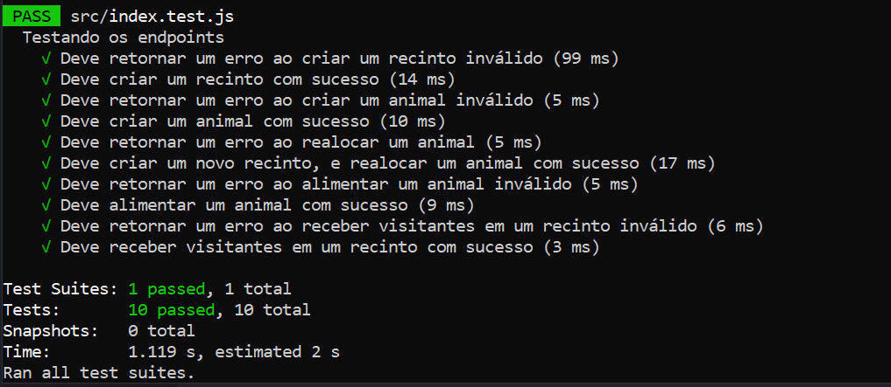

# Api de Zoológico

A implementação a seguir é uma API básica de um jogo de simulação de zoológico. O usuário pode criar um recinto, criar animais, editar seus recintos, alimentar os animais e simular a receita de cada recinto.

A API foi desenvolvida utilizando JavaScript, com as bibliotecas Node.js e Express, além do Jest para os testes de integração.

Para rodar a API, após instalar as dependências, basta utilizar:
```
npm run dev
```

# Classes
As duas classes principais são `"Animal"` e `"Recinto"`. Elas servem como base para as operações da api.

### Recinto
Ao ser instanciada, a classe "Recinto" cria um novo objeto recinto, que tem as propriedades `'nome'`, `'especieAceita'`, `'tratamento'`, `'animais'` e `'renda'`. Além disso, há o método `removerAnimal()`, que remove um animal específico do array 'animais' pelo nome; e o método `adicionarAnimal()`, que já recebe um objeto animal da espécie aceita, e adiciona ao array citado.

### Animal
Ao ser instanciada, a classe "Animal" cria um novo objeto animal, que tem as pripriedes `'nome'`, `'especie'` e `'felicidade'`, além do método `alimentar()`, que adciona um ponto de felicidade ao animal. 

Vale ressaltar que um animal não pode ser criado se não houver um recinto que aceite sua espécie. Assim que criado, o animal é alocado automaticamente para um recinto, mas ele pode ser alterado posteriormente.

# Endpoints
Para manipular as entidades, são utilizados os endpoints. Abaixo, há uma eplicação de como eles funcionam: 

- `/criar_recinto`

Essa rota é utilizada para criar um novo recinto. Os parêmetros a serem informados são:

```json
{
    "nome": "Ala N2",
    "especieAceita": "Tigre de Bengala",
    "tratamento": 9
}
```
<br>

- `/criar_animal`

Essa rota é utilizada para criar um novo animal. Os parâmetros a serem informados são:

```json
{
    "nome": "Scar",
    "especie": "Tigre de Bengala"
}
```
<br>

- `/realocar_animal`

Essa rota é utilizada para alterar o recinto de um animal. Os parâmetros a serem informados são:

```json
{
    "recintoAtual": "Ala N2",
    "recintoNovo": "Pavilhão C1",
    "nomeAnimal": "Scar"
}
```
obs: a operação não será realizada caso o novo recinto não aceite animais da mesma espécie.

<br>

- `/alimentar_animal`

Essa rota é utilizada para acionar o método alimentar() de um animal. O parâmetro a ser informado é:

```json
{
    "nomeAnimal": "Scar"
}
```
<br>

- `/receber_visitantes`

Essa rota é utilizada para calcular a receita gerada por um recinto, através dos visitantes.
Os parâmetros a serem informados são:

```json
{
    "recinto": "Pavilhão C1",
    "numeroVisitantes": 50
}
```
obs: Para o cálculo, são levados em conta o tratamento oferecido pelo recinto, e a felicidade dos animais alocados em tal.

# Testes

Utilizando as bibliotecas Jest e Supertest, foram implementados dois testes para cada endpoint. Um caso em que o teste passa com sucesso, e outro em que algum erro é disparado.

Para iniciar a [bateria de testes](./src/index.test.js), basta utilizar:
```
npm test
```
Os testes estão apresentados abaixo: 

- `/criar_recinto`
    - Caso de erro: O recinto não é criado, pois o 'tratamento' inserido é inválido. O status code 400 é retornado. 
    - Caso ótimo: O recinto é criado com sucesso, o status code 200 é retornado.


- `/criar_animal`
    - Caso de erro: O animal não é criado, pois a espécie inserida ainda não tem um recinto relacionado. O status code 400 é retornado.
    - Caso ótimo: O animal é criado com sucesso, o status code 200 é retornado.


- `/realocar_animal`
    - Caso de erro: O animal não é realocado, pois o novo recinto especificado ainda não existe. O status code 400 é retornado.
    - Caso ótimo: Junto ao teste, um novo recinto é craido e o animal é realocado com sucesso. O status code 200 é retornado.


- `/alimentar_animal`
    - Caso de erro: Nenhum animal é alimentado, pois o nome especificado ainda não existe no sistema. O status code 400 é retornado.
    - Caso ótimo: O animal especificado é alimentado com sucesso, o status code 200 é retornado.

- `/receber_visitantes`
    - Caso de erro: Nenhum recinto é visitado, pois o nome especificado ainda não existe no sistema. O status code 400 é retornado.
    - Caso ótimo: O recinto é visitado com sucesso, o status code 200 é retornado.

<br>


Testes de endpoint bem sucedidos.